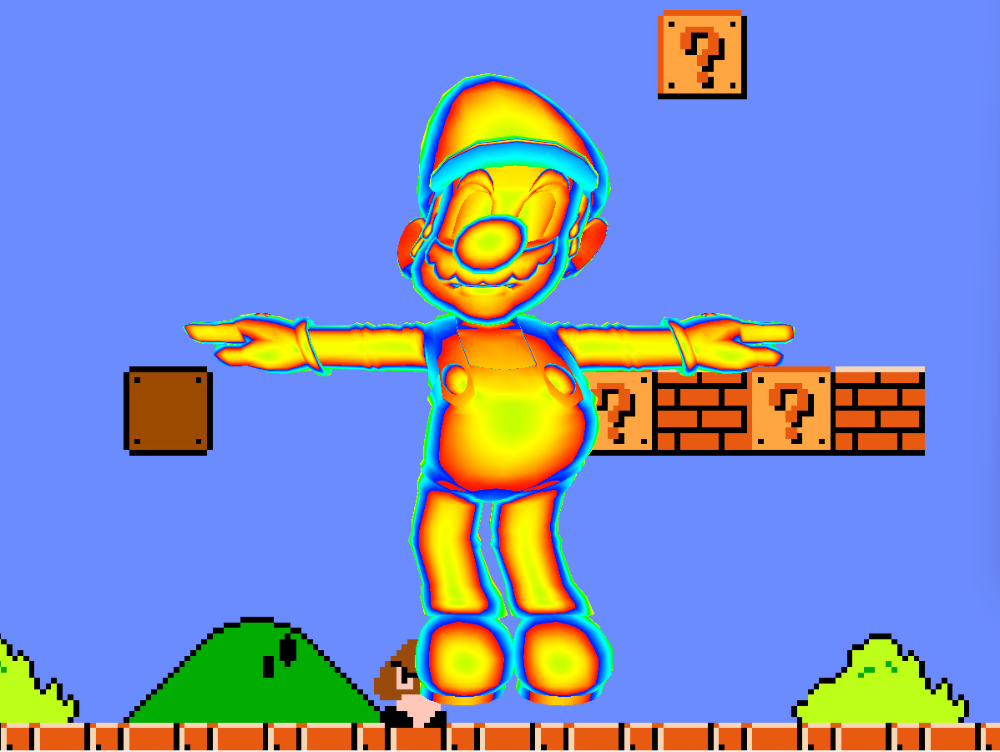

The implementation process of passing vertex data and index data to the GPU using VBO in OpenGL shader language.

Implementation of material representation using GLSL for vertex and fragment shaders.
1. feaded color fragment shader

2. vertex pos deformer 

Fragment buffer handling for screen post-processing.
1. post_bubble 

2. worleyCellCenter noise 

3. slobel process

4. blur

